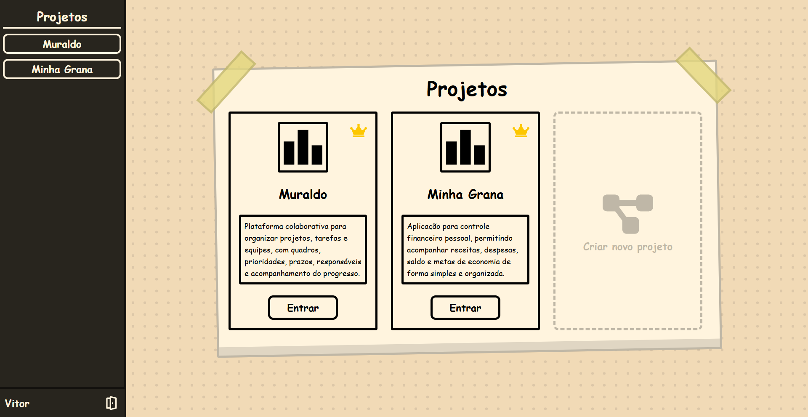
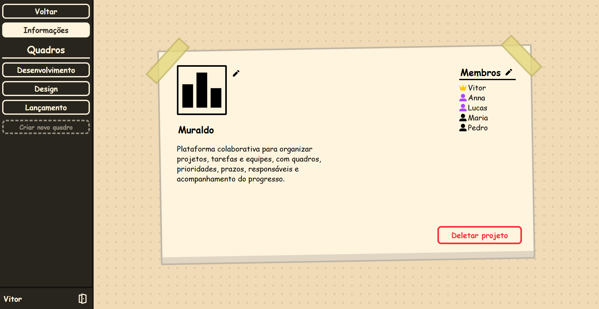
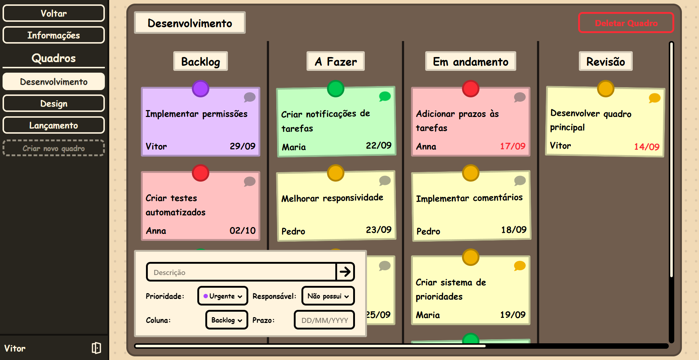
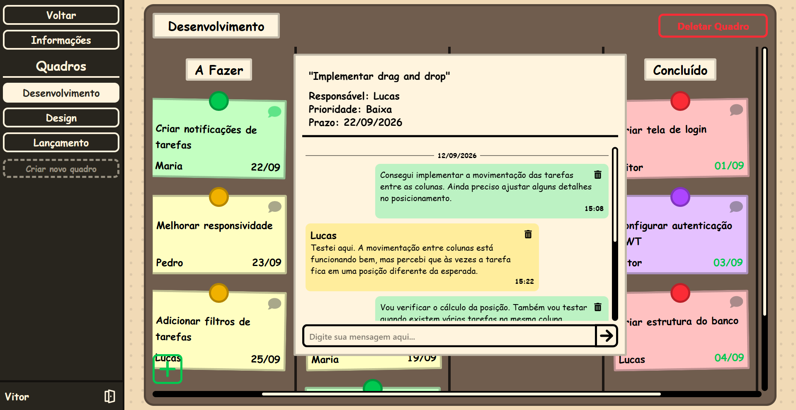

# Muraldo

Muraldo é uma aplicação de gerenciamento de projetos colaborativa, inspirada em quadros de post-its. A aplicação permite organizar projetos em quadros, colunas e tarefas, além de gerenciar membros, permissões, prazos, prioridades, comentários e conclusão de tarefas.

O projeto foi desenvolvido como uma aplicação full-stack para portfólio, utilizando React, TypeScript, Express e MySQL, com foco em uma arquitetura organizada, controle de autorização, operações transacionais no banco de dados, segurança e testes automatizados.

## Screenshots

### Projetos

Visão geral dos projetos disponíveis e acesso aos diferentes projetos da aplicação.



### Informações do projeto

Gerenciamento das informações do projeto, membros, permissões e quadros disponíveis.



### Quadro de desenvolvimento

Organização das tarefas utilizando colunas, prioridades, responsáveis e prazos, com suporte a drag and drop.



### Comentários

Sistema de comentários diretamente nas tarefas, permitindo comunicação entre os membros do projeto.



## Funcionalidades

### Projetos

- Criar e editar projetos
- Adicionar membros aos projetos
- Gerenciar permissões dos membros
- Conceder permissões de administrador
- Permitir que membros saiam dos projetos
- Permitir que o proprietário exclua projetos

### Quadros e colunas

- Criar e excluir quadros
- Criar, mover e excluir colunas
- Organizar colunas utilizando drag and drop
- Gerenciamento de quadros e colunas baseado em permissões

### Tarefas

- Criar e excluir tarefas
- Mover tarefas entre colunas utilizando drag and drop
- Atribuir tarefas aos membros do projeto
- Definir prioridades
- Definir prazos
- Avisos visuais para prazos próximos
- Marcar tarefas como concluídas
- Exibir a data de conclusão
- Excluir tarefas arrastando-as para a lixeira

### Comentários

- Adicionar comentários às tarefas
- Excluir os próprios comentários
- Proprietários e administradores podem excluir comentários
- Identificar comentários não lidos
- Separar comentários por data
- Exibir autor e horário dos comentários

## Tecnologias

### Frontend

- React
- TypeScript
- Vite
- Tailwind CSS
- Axios
- dnd-kit
- React Icons

### Backend

- Node.js
- Express
- MySQL
- JWT
- bcrypt
- Helmet
- CORS
- Cookie Parser
- express-rate-limit

### Testes

- Jest
- Supertest
- Banco de dados MySQL separado para testes

## Arquitetura

O Muraldo utiliza uma arquitetura em camadas para manter as responsabilidades da aplicação separadas.

```text
Frontend
│
├── Components
├── Pages
├── Contexts
├── Services
├── API
└── Utils
        │
        ▼
      HTTP
        │
        ▼
Backend
│
├── Routes
├── Controllers
├── Services
├── Middleware
├── Utils
└── Database
```

No frontend, os componentes são responsáveis pela interface, os contexts pelo estado compartilhado, os services pelas operações da aplicação e os módulos de API pela comunicação HTTP.

No backend, as routes definem os endpoints, os controllers lidam com as requisições e respostas HTTP, os services concentram as regras de negócio e a camada de banco de dados é responsável pela persistência.

Essa separação facilita a manutenção e permite alterar partes da aplicação sem criar dependências desnecessárias entre as diferentes camadas.

## Banco de dados

O Muraldo utiliza MySQL como banco de dados relacional.

A estrutura do banco está disponível no arquivo:

```text
schema.sql
```

O arquivo contém apenas a estrutura do banco, sem os dados utilizados durante o desenvolvimento. Dessa forma, o banco pode ser recriado sem expor usuários ou outros dados da aplicação.

## Testes

O backend possui uma suíte de testes automatizados cobrindo as principais funcionalidades da aplicação, incluindo:

- Autenticação
- Projetos
- Quadros
- Colunas
- Tarefas
- Comentários
- Usuários
- Permissões
- Autorização
- Tratamento de erros

Os testes utilizam Jest e Supertest e são executados utilizando um banco de dados MySQL separado do banco principal.

Para executar os testes:

```bash
npm test
```

## Como executar o projeto

### Pré-requisitos

- Node.js
- MySQL 8+
- npm

### 1. Clone o repositório

```bash
git clone <url-do-repositorio>
cd Muraldo
```

### 2. Configure o banco de dados

Crie o banco `project_manager` e importe o schema:

```bash
mysql -u root -p project_manager < schema.sql
```

Também é possível importar o arquivo utilizando o MySQL Workbench ou outro cliente MySQL.

### 3. Configure as variáveis de ambiente

Crie o arquivo `.env` dentro da pasta `server/`.

Exemplo:

```env
DB_HOST=localhost
DB_USER=root
DB_PASSWORD=sua_senha
DB_NAME=project_manager
SECRET_KEY=sua_chave_secreta
FRONTEND_URL=http://localhost:5173
```

Utilize os valores correspondentes ao seu ambiente.

### 4. Instale as dependências

Instale as dependências do frontend:

```bash
cd client
npm install
```

Depois, instale as dependências do backend:

```bash
cd ../server
npm install
```

### 5. Execute a aplicação

Execute o frontend e o backend utilizando os scripts definidos nos respectivos arquivos `package.json`.

Após iniciar os dois serviços, acesse a aplicação através do endereço fornecido pelo servidor de desenvolvimento do frontend.

## Estrutura do projeto

```text
Muraldo/
│
├── client/
│   └── src/
│       ├── api/
│       ├── components/
│       ├── contexts/
│       ├── hooks/
│       ├── pages/
│       ├── routes/
│       ├── services/
│       ├── types/
│       └── utils/
│
├── server/
│   └── src/
│       ├── controllers/
│       ├── middleware/
│       ├── routes/
│       ├── services/
│       ├── tests/
│       └── utils/
│
├── screenshots/
├── schema.sql
├── README.md
└── .gitignore
```

## Segurança

A segurança foi considerada em diferentes partes da aplicação, não apenas no sistema de autenticação.

Entre as medidas implementadas estão:

- Senhas armazenadas utilizando bcrypt.
- Tokens de autenticação armazenados em cookies HTTP-only.
- Cookies de produção configurados para utilização segura.
- CORS restringindo as origens permitidas.
- Validação de `Origin` em requisições que alteram dados.
- Headers de segurança fornecidos pelo Helmet.
- Rate limiting para proteção de endpoints sensíveis.
- Verificação de membros e permissões antes de operações protegidas.
- Queries SQL parametrizadas para evitar SQL injection.

## O que aprendi

O desenvolvimento do Muraldo proporcionou experiência em diferentes áreas do desenvolvimento full-stack, incluindo:

- Estruturação de uma aplicação full-stack
- Desenvolvimento de APIs REST com Express
- Modelagem de banco de dados relacional com MySQL
- Implementação de autenticação e autorização
- Implementação de permissões baseadas em funções
- Utilização de transações e bloqueios no banco de dados
- Implementação de interações drag and drop com dnd-kit
- Gerenciamento de estado compartilhado com React Context
- Desenvolvimento de testes automatizados com Jest e Supertest
- Aplicação de práticas de segurança como CORS, proteção contra CSRF, cookies e rate limiting

## Licença

Este projeto foi desenvolvido como um projeto pessoal para portfólio.
